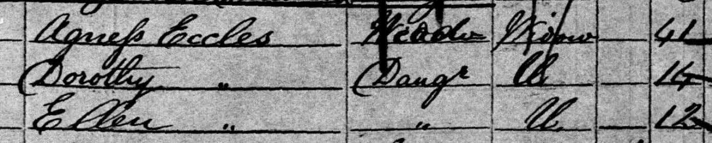
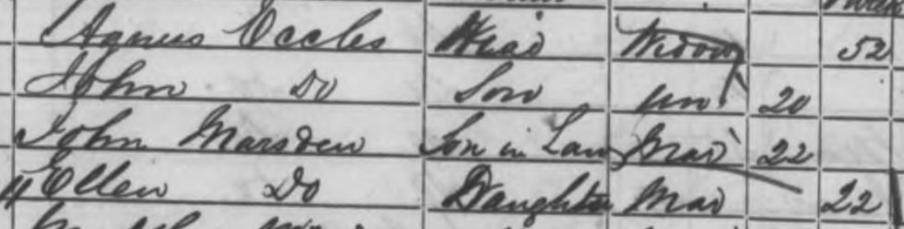
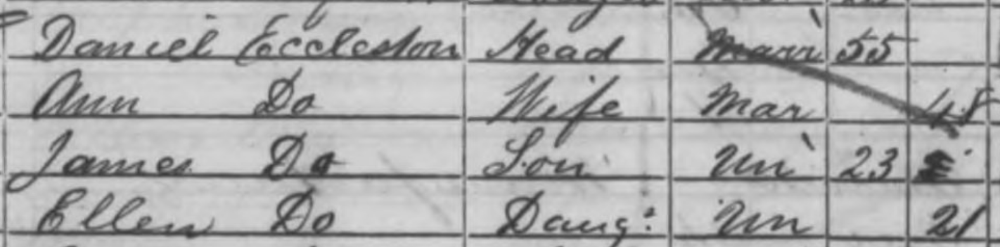
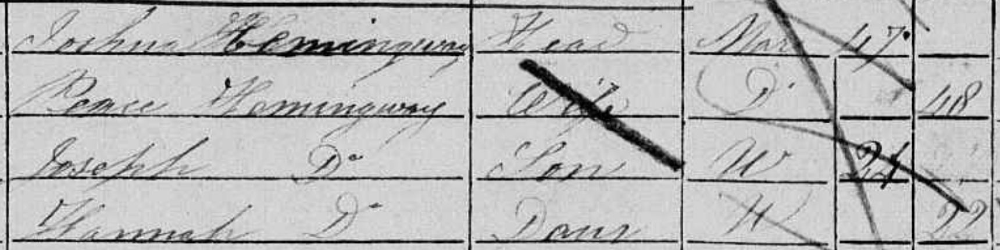
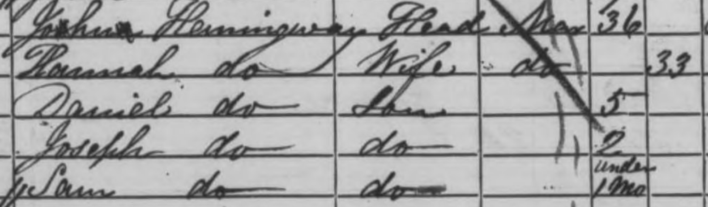
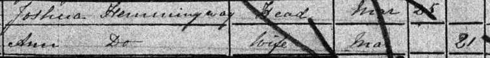
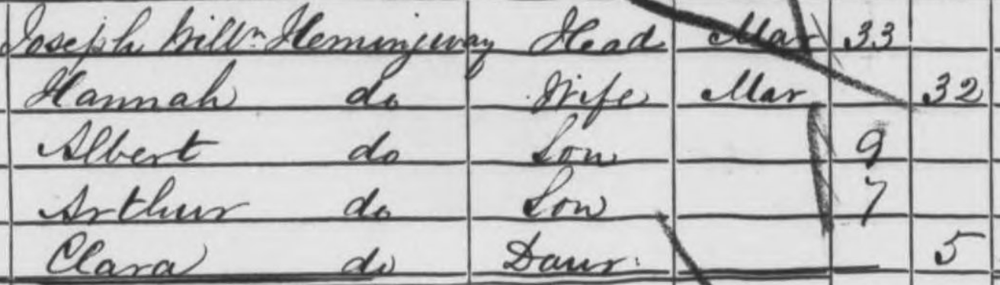
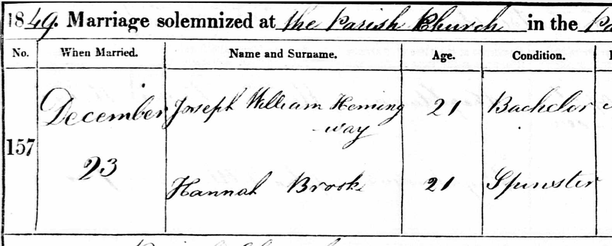
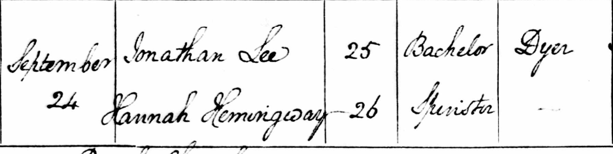
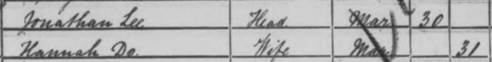

+++
date = '2026-04-30T12:00:03+01:00'
draft = false
title = 'Brief reflections on record linkage with historic British census data (I-CeM)'
ShowToc = true
tags = ["census", "record-linkage", "icem"]
author = "Josh"
+++

I've just come across an impressive [working paper](https://doi.org/10.17863/CAM.120530) released by researchers at the University of Cambridge in August 2025 detailing the first attempt to link every person between the 1851 and 1921 England and Wales censuses. There have been several attempts to link subsets of individuals between censuses using I-CeM data. But this is the first to link so many - 74 million people (56% of the population)! 👏 to the paper's authors G. Proffit, A. Litvine, E. Diduch, R. Linacre & E. Chung - I'm looking forward to reading the published paper when it's out!

Very generously, they've released a [10% sample](https://doi.org/10.5281/zenodo.17184801) of their record linkage dataset ahead of full publication. In this post, I'm using this sample (hereafter PLD25) to explore their links between the 1851 and 1861 censuses and comparing them with my own linked subset of people for the same years.

See the [full citation](#pld-citation) to their preliminary data and working paper.

### PLD25 sample

For anyone familiar with I-CeM data, skip to the [Initial Results](#initial-results).

This is what the 10% linked sample looks like:

unique_id_l|unique_id_r|
:--:|:--:|
1851/13855314|1861/15945942|
1851/17205716|1861/9964164|
1851/6503654|1861/7043768|

The numbers to the right of the slashes are the `recid` values (unique person identifiers) found in I-CeM. This table is telling us that `recid` 13855314 in 1851 and `recid` 15945942 in 1861 are the same person. You can join these id values to a full copy of I-CeM to add all the information in the census for this person (name, address, occupation, age, gender etc). N.B. The names and addresses in I-CeM are a separate dataset that you need a [special licence](http://doi.org/10.5255/UKDA-SN-7856-2) to access. If you don't have access to the special licence, read [this post](https://www.joshuarhodeshistorian.com/posts/lookup-original-census-records/) about creating URLs to find the individuals (and their names) on original census records via [findmypast.com](https://www.findmypast.com) or [socialhistoryarchive.com](https://www.thesocialhistoryarchive.com/).

### Initial results

There are 651,524 people in the 10% linked 1851-1861 sample. I have a sample of 154,544 weavers linked between the same censuses that I created for an article analysing the impact of the powerloom on handloom weavers. My analysis below is based on the 10,000 weavers found in both samples.

Encouragingly, we linked the same people in 87.4% (8,736 weavers) of cases. But just because we've come to the same result doesn't necessarily mean these are all correct (aka [true positives](https://en.wikipedia.org/wiki/Sensitivity_and_specificity)). Some of these will be wrong but it would take me far too long to manually check each one! It's encouraging that we've come to the same result in almost 90% of cases since we've independently run different types of linkage algorithm ([mine deterministic, theirs probabalistic](https://moj-analytical-services.github.io/splink/topic_guides/theory/probabilistic_vs_deterministic.html)) and come back with the same result. I think it's safe to say that we won't be able to improve much further on these links without improving the quality of the transcriptions underpinning the data.

Now for the interesting bit, the 22.6% where we disagree...

I've manually looked up the original census returns for these 1,264 weavers on [findmypast.com](https://www.findmypast.com). You can [download](data/weavers_pld_comparison.csv) the recids of these weavers (the 1851 recids, my 1861 link, and the PLD 1861 link).

Here's what I found:

Status|n|%|
--|--|--|
JR correct|1005|79.5%
PLD correct|182|14.4%
Both wrong|41|3.2%
Uncertain|36|2.8%

I'm pretty happy to see that my links turned out to be correct in most cases (almost 80%) among the ones where we differed. Especially because my links are based on work I did several years ago on the [Living with Machines](https://livingwithmachines.ac.uk/) project. In about 15% of cases the PLD sample had it right. There were some where we were both wrong or I just couldn't work out which was the correct link.

If we add back in our weavers who we agree on, we can work out some rough overall error rates. I reckon an error rate of at least 10.46% for PLD25 (1,046/10,000) compared to 2.23% (223/10,000) for my weavers sample though both will be higher because as mentioned above not all of the links we agree on will be correct. This is pretty similar to the overall error rate (10.16%) reported in their working paper for 1851-61 with another 3.87% as uncertain links. The larger PLD dataset will have a **much** better recall rate than mine though because it's blocking rules are less strict (they can afford to be because of their probabalistic approach). Though I think my linking results show there's scope to reduce the numbers of false positives they're getting.

One of the big leaps forward in the PLD linking methodology is that they've used marriage records to capture women who married between census years and who are otherwise incredibly difficult to link because their surname changed. PLD definitely performs better for women than it does men but it's still not beating out my weaver's sample in false positives.

But, the PLD sample did link 47 women who married between the 1851 and 1861 censuses that I'd incorrectly linked.

Take the example of 12-year-old Ellen Eccles in 1851:

The PLD method correctly links Ellen Eccles to Ellen Marsden in 1861, which we can tell is right from the CEB page because we can see Ellen's mother Agnes listed here too:

In my sample, I'd linked Ellen incorrectly to an Ellen Eccleston in 1861:

My linking algorithm has deemed Ellen Eccleston a sufficiently good match (probably linking on the 'Eccles' in 'Eccleston') and so therefore hasn't looked for women with different surnames as an alternative. In theory, I should have been able to locate Ellen Eccles/Marsden correctly since she's listed with her mother both times and one of my linking stages searches for co-resident family members for women while dropping the requirement for their surname to match. See Ryah Thomas's [Oxford MPhil Thesis](https://dx.doi.org/10.5287/ora-bpm47pvbx) which shaped how I developed linking for women via co-residency.

### Some initial thoughts

Here are some basic thoughts I've had about common errors that cropped up in my sample and the PLD sample:

#### Men matching with different surnames

In the PLD25 sample, 286 links (2.86% of 10,000 surveyed) were made between men with different surnames. In each case, there was a more plausible match with a man with the same surname. Should there be some sort of block that prevents accepting a match if a man's surname is different? It must be pretty rare for these to be true matches (perhaps only when transcription errors or mis-tabulations have led to the wrong surname being recorded in I-CeM)?

#### Should we use mutable charactistics?

PLD25 uses 'mutable' (changeable) characteristics like occupations in some parts of their linking process. In their working paper they argue for the overall improved matching this can achieve despite its drawbacks for creating a biased linked sample. (The same criticism can be levied at using the persistence of co-resident household members across census years, which my algorithm partly relies on for matching women). I think a lot of this depends on what you want to do with the linked data. It would be an obvious problem for studying occupational change like I am doing (and others have done - [example1](https://github.com/HillaryVipond/JMP/blob/main/Technological_Unemployment_in_Victorian_Britain_VipondH.pdf), [example2](https://doi.org/10.17863/CAM.50180)) and I'm sure would be a lot of historians' first thoughts for what to do with linked census data.

#### Extreme age differences

In the PLD25 sample, 383 links (3.83% of 10,000 surveyed) were made between people with very large age differences ranging from -56 years to +74 years. Should these be accepted as possible links?

#### Prevent women with the same maiden and married names matching?

When checking the matches for women, there were lots of examples in both our datasets where an unmarried woman has been linked to a married woman with the same surname. What are the chances that a woman marries a man with the same surname as her maiden name? Pretty slim overall, I think, but of course not impossible, and no doubt not randomly distributed through the population. We could easily flag women (unmarried -> married) with the same surname and ensure a higher threshold for other matching criteria if we are going to accept the match.

Hannah Hemmingway is an example where both our links were wrong because we'd linked to another Hannah Hemmingway, who'd taken the Hemmingway surname on marriage.

The unmarried 22-year-old Hannah we're trying to link (*recid 1851/14600397*):

I linked to this 33-year-old Hannah Hemmingway (*recid 1861/16219430*):

Who was actually already married in 1851:

PLD25 linked to this 32-year-old Hannah Hemmingway (*recid 1861/16206687*):

Who's actually neé Brook:

So, can we find our original 22-year-old Hannah Hemmingway?

Yes!

Here she is getting married in 1855. Her dad's occupation checks out as a Sawyer across both census and marriage register (not shown in this image):

And finally, here she is in the 1861 census, still living in Dewsbury where she was living in 1851 with her family:

### PLD Citation

> Proffit, G., Litvine, A., Diduch, E., Linacre, R., & Chung, E. (2025). A First Full-Count Linking of English and Welsh Censuses, 1851-1921, data (https://doi.org/10.5281/zenodo.15727456) and working paper (https://doi.org/10.17863/CAM.120530)

All images courtesy of [socialhistoryarchive.com](https://www.thesocialhistoryarchive.com) and [ancestry.com](https://www.ancestry.com)